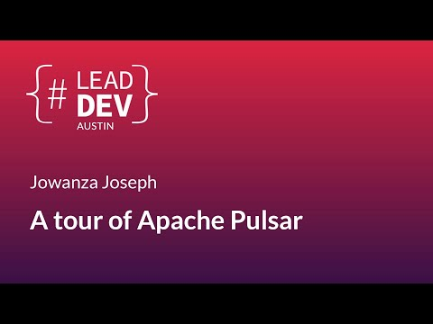

# A tour of Apache Pulsar - Jowanza Joseph

## Speaker

* [Jowanza Joseph](https://www.jowanza.com/)
* [Twitter](https://twitter.com/Jowanza)
* [LinkedIn](https://www.linkedin.com/in/jowanza/)

## Video

<iframe width="840" height="472" src="https://www.youtube.com/embed/7h7hA7APa5Y"
frameborder="0"
allow="accelerometer; autoplay; encrypted-media; gyroscope; picture-in-picture"
allowfullscreen>
</iframe>

## Source

* At [The Lead Developer Austin](https://austin2018.theleaddeveloper.com/)

## Notes

* [Apache Pulsar](https://pulsar.apache.org/)
* Pulsar Functions
* Schema registry
* Tiered Storage (Book keeper, S3, Glacier)
* Pulsar SQL

