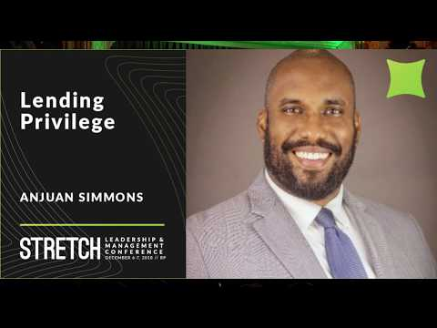
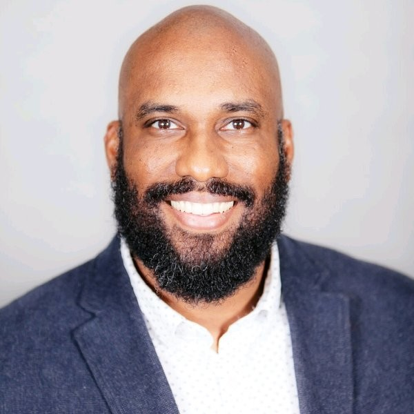

# Anjuan Simmons: Lending Privilege

From Star Trek to modern day equality, diversity, and inclusiveness. What can you do?

## Speaker

* [Anjuan Simmons](https://anjuansimmons.com/)
* [Twitter](https://twitter.com/anjuan)
* [LinkedIn](https://www.linkedin.com/in/anjuan/)

## Video

* <a href="https://www.youtube.com/watch?v=hyiMathkUrQ">Lending Privilege</a>

<iframe width="840" height="472" src="https://www.youtube.com/embed/hyiMathkUrQ"
frameborder="0"
allow="accelerometer; autoplay; encrypted-media; gyroscope; picture-in-picture"
allowfullscreen>
</iframe>

## Source

* [Strech Conference Budapest](http://www.stretchcon.com/2018/)

## Notes

* [Leonard Nimoy](https://en.wikipedia.org/wiki/Leonard_Nimoy)
* [Nichelle Nichols](https://en.wikipedia.org/wiki/Nichelle_Nichols)
* [Star Trek](https://startrek.com/)

* [ASA - American Sociological Association](https://www.asanet.org/)
* [Does Diversity Pay? (pdf)](https://www.asanet.org/sites/default/files/savvy/images/journals/docs/pdf/asr/Apr09ASRFeature.pdf)

* [Peterson Institute for International Economics](https://piie.com/)
* [Is Gender Diversity Profitable? Evidence from a Global Survey](https://piie.com/publications/working-papers/gender-diversity-profitable-evidence-global-survey)

* Diversity and inclusiveness is not the same.
* Inclusion is to have emphaty.
* Inclusion goes further than diversity.

* HR works for the company and not for you, the employee.

* [The Cathedral and the Bazaar](https://en.wikipedia.org/wiki/The_Cathedral_and_the_Bazaar) by Eric S. Raymond.

### Privilages

* Birth privilages: Parental, gender, race, physical abilities
* Selected privilages: education, religion

### Privilage lending

* Creditibility lending
* [Colbert report](http://www.cc.com/shows/the-colbert-report)

* Access lending
* Expertese lending
* [South by Southwest](https://sxsw.com/)

* [Common (rapper)](https://en.wikipedia.org/wiki/Common_(rapper))
* [Selma (movie)](https://en.wikipedia.org/wiki/Selma_(film))
* [Glory](https://www.youtube.com/watch?v=HUZOKvYcx_o)

* [The Constitution of the United States](https://www.archives.gov/founding-docs/constitution-transcript)

