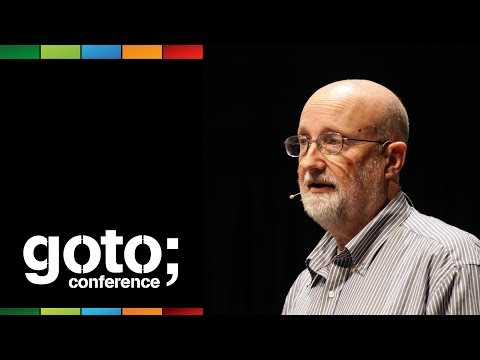
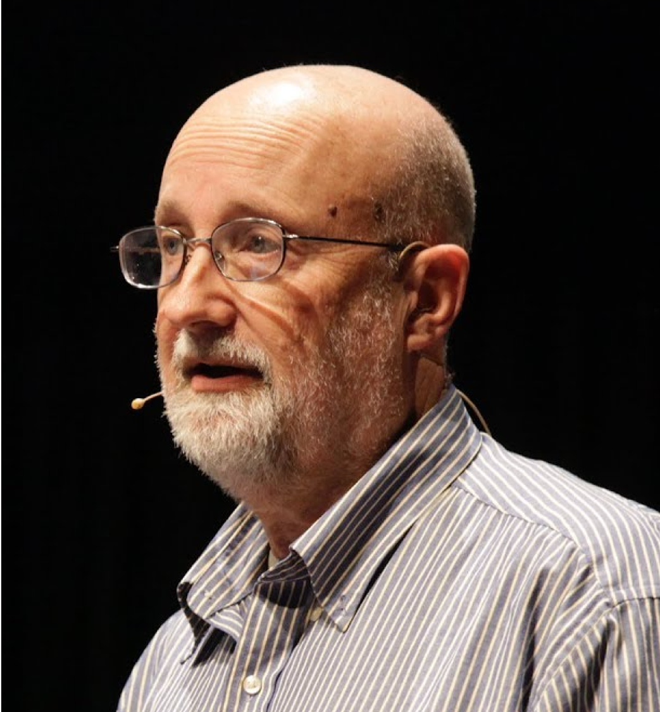

# Woody Zuill - Mob Programming: A Whole Team Approach

Mob programming is all the brilliant minds working on the same thing, at the same time, in the same space and on the
same computer.

## Speaker

* [Woody Zuill](https://woodyzuill.com/)
* [Twitter](https://twitter.com/WoodyZuill)
* [LinkedIn](https://www.linkedin.com/in/woodyzuill/)

## Video

* 

<iframe width="840" height="472" src="https://www.youtube.com/embed/SHOVVnRB4h0"
frameborder="0"
allow="accelerometer; autoplay; encrypted-media; gyroscope; picture-in-picture"
allowfullscreen>
</iframe>

## Source

* At [Craft-Conf Budapest 2019](https://craft-conf.com/)

## Slides

## Notes

* Agile and eXtreme programming.
* It is like pair programming but with more people.
* "A continuous integration of ideas".
* Communication in real time.
* The team in the picture: 2 testers, product expert, database expert (dba), legacy code expert (who knows the projects in the company), 2 coding experts, and the manager.
* [Hunter Industries](https://www.hunterindustries.com/)

* Drawings by [Andra Zuill](https://www.andreazuill.org/)

