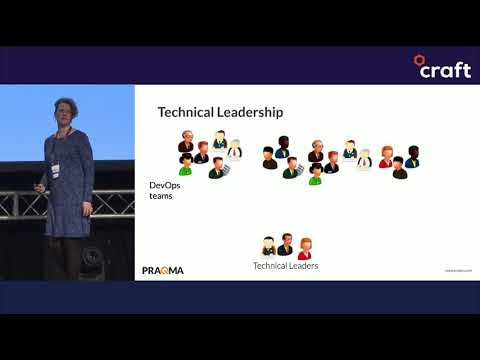

# Emily Bache: Technical Leadership and Empowered Teams

## Speaker

* Emily Bache is Technical Agile Coach at [Praqma](https://www.praqma.com/)
* [Emily Bache: coding is like cooking](http://coding-is-like-cooking.info/)
* [Twitter](https://twitter.com/emilybache)
* [LinkedIn](https://www.linkedin.com/in/emilybache/)

## Video

* [Technical Leadership and Empowered Teams](https://www.youtube.com/watch?v=qnujkFY2gKs)

<iframe width="840" height="472" src="https://www.youtube.com/embed/qnujkFY2gKs"
frameborder="0"
allow="accelerometer; autoplay; encrypted-media; gyroscope; picture-in-picture"
allowfullscreen>
</iframe>

## Source

* At [Craft Conf Budapest 2019](https://craft-conf.com/)

## Notes

* [Woody Zuill](https://twitter.com/WoodyZuill)
* [Mob Programming](https://mobprogramming.org/)
* How to measure programmer productivity?
* Everyone understands the code
* Skill Transfer
* Visitors are quickly contributors

### Books

* [Accelerate: The Science of Lean Software and DevOps: Building and Scaling High Performing Technology Organizations](https://www.amazon.com/Accelerate-Software-Performing-Technology-Organizations/dp/1942788339)
* [Woody Zuill and Kevin Meadows: Mob Programming - A Whole Team Approach](https://leanpub.com/mobprogramming)
* [Emily Bache: Coding Dojo Handbook](https://leanpub.com/codingdojohandbook)
* [Emily Bache: Mocks](https://leanpub.com/mocks-fakes-stubs)
* [Maaret Pyhäjärvi: The Mob Programming Guidebook](https://mobprogrammingguidebook.xyz/)
* [Llewellyn Falco:  The Mob Programming Guidebook](http://www.mobprogrammingguidebook.com/)

### Definitions

* [Pair Programming](https://en.wikipedia.org/wiki/Pair_programming)
* [Mob programming](https://en.wikipedia.org/wiki/Mob_programming)

