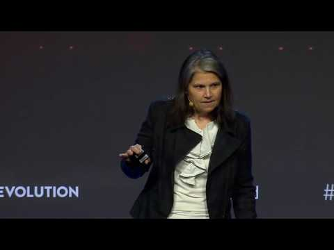

# Dominica DeGrandis: Time Theft: How Hidden and Unplanned work Commit the Perfect Crime

The five sources of unaccounted work. How to make our work and the time we spend on it visible. How to eliminate the waste and become much more productive.

## Speaker

* [Dominica DeGrandis Kanban Flow expert](http://ddegrandis.com/)
* [Twitter](https://twitter.com/dominicad)
* [LinkedIn](https://www.linkedin.com/in/dominicadegrandis/)

## Video

[Time Theft](https://www.youtube.com/watch?v=-TGJePmaaas)

<iframe width="840" height="472" src="https://www.youtube.com/embed/-TGJePmaaas"
frameborder="0"
allow="accelerometer; autoplay; encrypted-media; gyroscope; picture-in-picture"
allowfullscreen>
</iframe>

## Source

* [Devops Summit 2016](https://events.itrevolution.com/)
* [Dominica DeGrandis at DevOps Summit 2016](https://itrevolution.com/faculty/dominica-degrandis/)

## Notes

### The five time thieves

* Unplanned work
* Neglected work
* Unknown dependencies
* Conflicting priorities
* Too much WIP (Work in Progress)

* WIP is a leading indicator
* [Little's Law](https://en.wikipedia.org/wiki/Little%27s_law)

### CIOs want

* More predictibility
* Less risk

* "We don't let our servers reach 100% capacity, why do we let people reach 100% utilization?"

* [Edward Deming: Out of the crisis](https://www.amazon.com/Out-Crisis-Press-Edwards-Deming/dp/0262541157)
* [Peter M. Senge: The necessary revolution: How Individuals and Organizations Are Working Together to Create a Sustainable World](https://www.amazon.com/Necessary-Revolution-Individuals-Organizations-Sustainable/dp/0385519044)
* [Troy Magennis: Forecasting and Simulating Software Development projects](https://www.amazon.com/Forecasting-Simulating-Software-Development-Projects/dp/1466454830/)
* [Donald G. Reinertsen: The principles of product development flow: Second Generation Lean Product Development](https://www.amazon.com/Principles-Product-Development-Flow-Generation/dp/1935401009)
* [Daniel S. Vacanti: Actionable Agile metrics for predictability:  An Introduction](https://www.amazon.com/Actionable-Agile-Metrics-Predictability-Introduction/dp/098643633X/)

